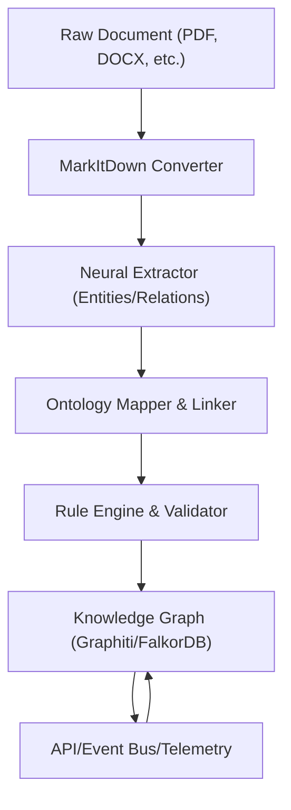

# Neurosymbolic Knowledge Management Architecture

## Overview
This document describes the layered architecture for the neurosymbolic knowledge management system, supporting hybrid agent workflows, dynamic ontology, and extensibility.

---

## Layered Architecture

### 1. Perception Layer
- **Purpose:** Ingests and preprocesses raw documents (Markdown, PDF, DOCX, etc.). Performs neural extraction of entities, relationships, and metadata.
- **Key Components:**
  - Document Converter (MarkItDown)
  - Extractor Models (LLMs, NER, relation extraction)
  - Adapters for input/output standardization
- **Extensibility:** Plug in new extraction models, document types, or pre/post-processing steps.

### 2. Semantic Layer
- **Purpose:** Maps extracted entities/relations to a dynamic, extendable ontology. Normalizes, deduplicates, and links data to the existing knowledge graph (KG).
- **Key Components:**
  - Ontology Manager (dynamic schema, Data Vault 2.0 inspired)
  - Entity/Relation Mappers
  - Linker for deduplication and reference resolution
- **Extensibility:** Ontology plugins/extensions, dynamic schema updates, versioning.

### 3. Reasoning Layer
- **Purpose:** Applies symbolic rules, validation, and inference over the KG. Ensures consistency, detects conflicts, and derives new knowledge.
- **Key Components:**
  - Rule Engine (simple to advanced logic/metaprogramming)
  - Validator (ontology/KG consistency)
  - Inference Engine (future)
- **Extensibility:** New rule sets, logic modules, or external reasoning engines.

### 4. Application Layer
- **Purpose:** Exposes APIs and interfaces for agents, users, and external systems to interact with the KG. Handles queries, updates, analytics, and collaboration.
- **Key Components:**
  - API Gateway (FastAPI endpoints)
  - Event Bus (RabbitMQ)
  - RBAC Module
  - Telemetry/Monitoring (OpenLLMetry)
- **Extensibility:** New APIs, event types, analytics modules, MCP integration.

---

## Data Flow Diagram

---

## Extensibility & Configuration
- Pluggable modules at each layer (extractors, ontology plugins, rule sets)
- Configurable KG backend (Graphiti, FalkorDB)
- Configurable management mode (dedicated, integrated, hybrid)
- Dynamic ontology/schema support

---

## Next Steps
- Define interfaces and data contracts between layers
- Document extensibility/configuration points
- Expand architecture diagrams as needed 